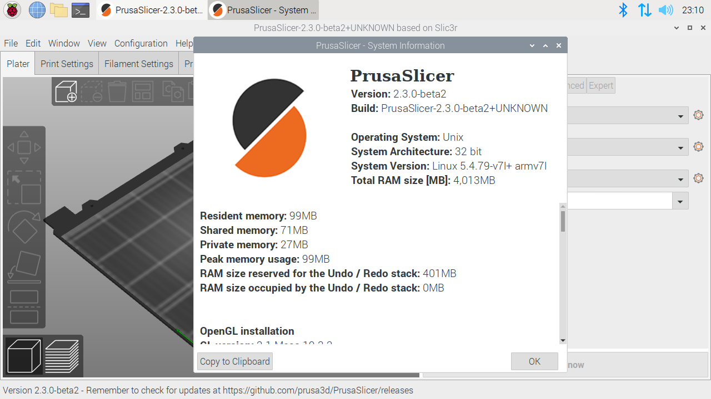

# PrusaSlicer-ARM.AppImage

PrusaSlicer packaged in an ARM AppImage for the Raspberry Pi 4. Build utilities and releases.

To get a pre-built AppImage, see [Releases](https://github.com/davidk/PrusaSlicer-ARM.AppImage/releases).

# Tested with

Raspberry Pi 4 (Raspbian Buster), Raspberry Pi 3 (Raspbian Buster)

# Dependencies 

These need to be installed on Raspbian Buster for the AppImage to work.

    sudo apt install -y libboost-dev libboost-regex-dev libboost-filesystem-dev \
    libboost-thread-dev libboost-log-dev libboost-locale-dev libcurl4-openssl-dev \
    libwxgtk3.0-dev libtbb-dev libcereal-dev
    
# Building your own AppImage

Requirement: Raspberry Pi 4 (or better).

If for any reason you would like to build your own ARM AppImage, all the files needed for doing so are in this repository. Clone or download this repository and run `./build.sh` in the root of the repository. 

This will install dependencies for building, compile PrusaSlicer, and drop a AppImage into `PrusaSlicer-ARM.AppImage/pkg2appimage/out`.

Copy the AppImage into a good location and run it.

# Needs to be implemented (contributions welcome)

- [ ] Version tagging post-build

- [ ] More dependency bundling with pkg2appimage
